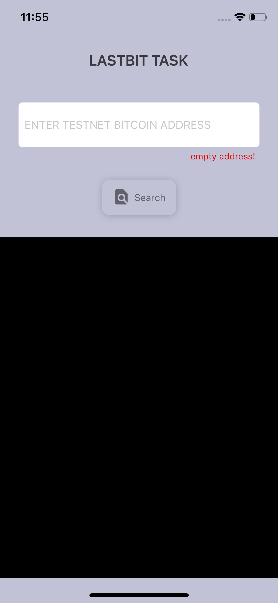
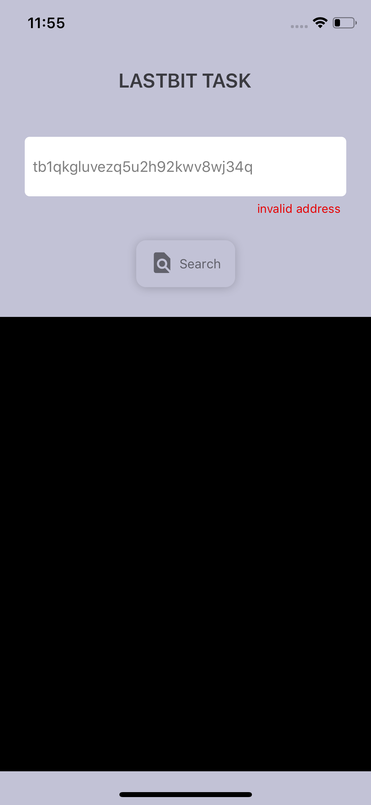
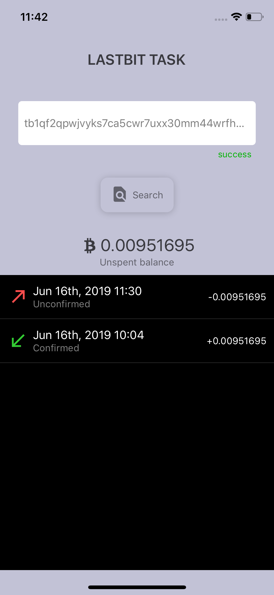
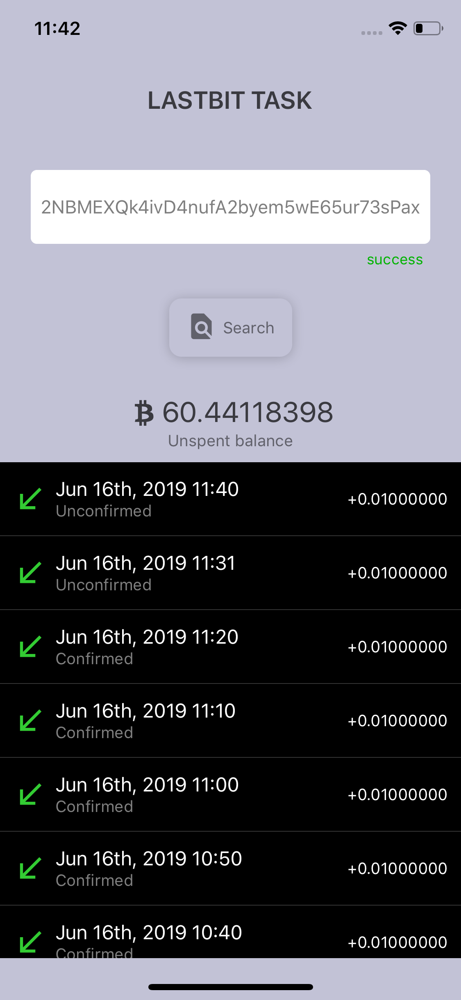

## Testnet bitcoin address details app.

This app will give you details about the textnet bitcoin transactions and unspent bitcoin balance at that address.

## Getting Started

### Installation

```
yarn install
```

## API

I have used `SoChain` API for fetching the transactions for the address and the available unspent bitcoin balance at that address.

[SoChain Bitcoin(Testnet)](https://chain.so/testnet/btc)

### Screenshots

<p align="center">
  
  
  
  
</p>
